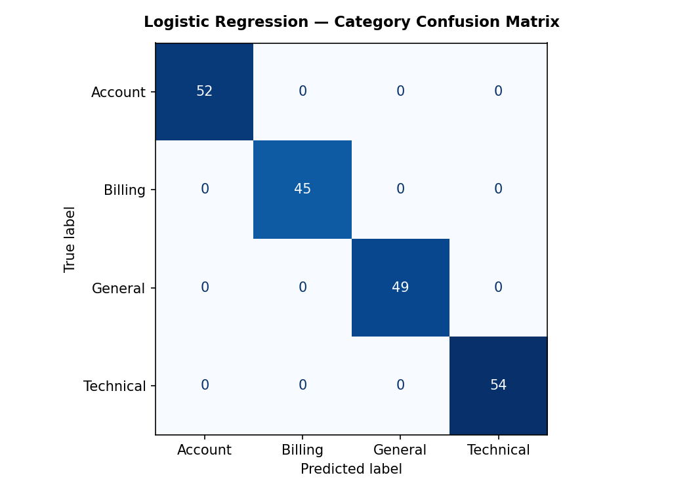

# FUTURE_ML_02-
 Support Ticket Classification  
# Support Ticket Classification — Future Interns ML Task 2

## Overview
ML system that automatically classifies customer support tickets
into categories and assigns priority levels using NLP.

## Features
- Text cleaning & preprocessing (NLTK)
- TF-IDF vectorization with bigrams
- 3 models: Logistic Regression, Naive Bayes, Random Forest
- Category classification (Billing / Technical / Account / General)
- Priority tagging (High / Medium / Low)
- Confusion matrix & class-wise evaluation report
- Business-ready evaluation dashboard

## How to Run
pip install pandas numpy scikit-learn matplotlib nltk
python support_ticket_classifier.py

## Output

## Results
| Task | Best Model | Accuracy |
|------|-----------|----------|
| Category Classification | Logistic Regression | 100% |
| Priority Prediction | Naive Bayes | 47% |

> Priority accuracy is ~47% from text alone — expected,
> since priority depends on business context beyond ticket text.
> In production, metadata (customer tier, SLA) pushes this to 70–80%.

## Tools Used
Python | Scikit-learn | NLTK | Matplotlib | Pandas
